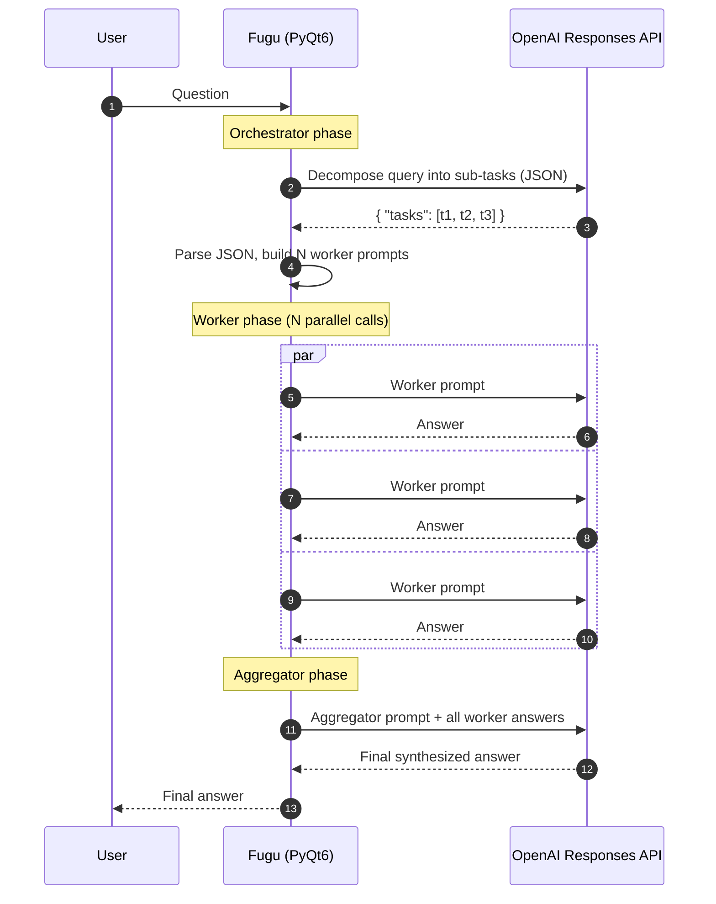
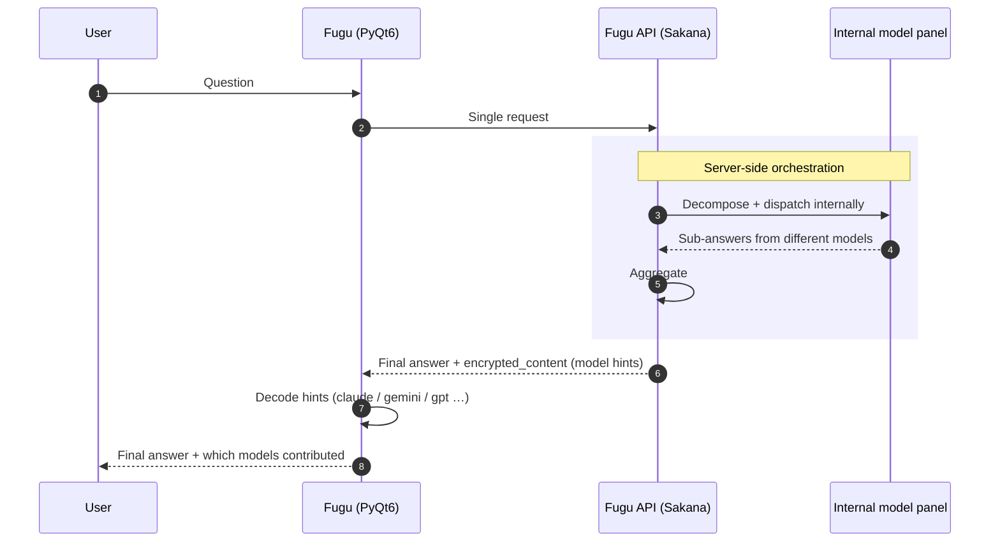
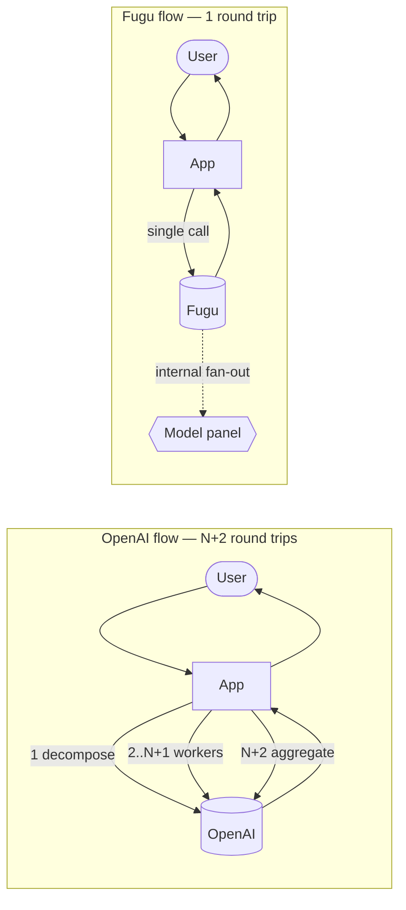

[English](README.md) | [한국어](README.ko.md) | [中文](README.zh.md) | 日本語

# Fugu

**multi-step agent orchestration** パターンを 2 つの異なるバックエンドに対して
ベンチマークするための PyQt6 デスクトップクライアントです: 従来型の OpenAI
Responses API ワークフローと、サーバー側でオーケストレーションを処理する
[Sakana AI](https://sakana.ai) の Fugu モデルラインです。

このアプリは意図的に小さく作られています — 完成品ではなく、テストハーネスです。
このアプリは 1 つの特定の比較を明確にするために存在します: クエリがタスク分解、
並列サブ質問への回答、最終集約を必要とするとき、**そのループはどこに存在するのか —
クライアント側か、それともモデル内か?**

---

## 何を検証しているのか?

現代の「agentic」な LLM ワークフローは、自明でないクエリに対して通常 3 つのステップを
必要とします:

1. ユーザーの質問をサブ質問またはサブタスクに **分解 (Decompose)** する。
2. 各サブタスクを **実行 (Execute)** する — 通常は別個の LLM 呼び出しで、しばしば
   異なるプロンプトを使用します。
3. サブ結果を一貫した最終回答に **集約 (Aggregate)** する。

これが **Orchestrator → Workers → Aggregator** パターンです。今日の OpenAI Responses
API では、オーケストレーションループはアプリケーションコード内で実装する必要が
あります。すべてのフェーズが個別のラウンドトリップになり、すべてのリトライ、
プロンプトテンプレート、JSON パーサー、並列ディスパッチをクライアントが所有しなければ
なりません。

Fugu の主張は、オーケストレーションループをモデル自体に移すというものです。
クライアントは 1 回のリクエストを行い、モデルは内部的に異種 (heterogeneous) な
サブモデルパネル (異なるベンダー、異なるサイズ) にファンアウトし、応答を集約して
単一の最終出力を返します。応答には、内部でどのモデルが使われたかについてのヒントが
含まれており、クライアントがそれを表示できるようになっています。

このアプリは両方のフローを並べて実装し、同じクエリに対してトレードオフ (レイテンシ、
コードの複雑さ、トークンの会計、可観測性) を比較できるようにしています。

---

## アーキテクチャ比較

### 現状 — OpenAI Orchestrator (クライアント側ループ)

クライアントがオーケストレーションループを所有します。3 つの API フェーズがあり、
うち 2 つは N 個の並列呼び出しを伴い、すべてデスクトップ上の PyQt6 から調整されます。



**クライアントが所有すべきもの:**
- orchestrator / worker / aggregator のプロンプトテンプレート
- orchestrator のタスクリスト用 JSON パーサー + クリーンアップ
- 並列ディスパッチ (`asyncio.gather` / `as_completed`)
- 呼び出しごとのリトライ、エラー処理、強制停止
- orchestrator + N 個の worker + aggregator にわたるトークン使用量の累積
- 各フェーズのストリーミング UX

コスト面は **1 + N + 1 ラウンドトリップ** で、すべてクライアントから可視であり
課金対象です。

### Fugu の場合 (サーバー側オーケストレーション)

クライアントは 1 回呼び出すだけです。モデルは内部で異種のサブモデルパネルを参照し、
その出力を集約し、参加したモデルに関するヒントを埋め込んだ単一の応答を返します。



**クライアントが所有するもの:**
- 1 つのプロンプト
- 1 つのレスポンスパーサー
- encrypted_content blob 用のヒントデコーダ (どのモデルが寄与したか)

コスト面は **1 ラウンドトリップ** です。分解、並列性、集約はサーバーの責務です。

### 同じ絵を並べて比較



このリポジトリの関連コードパス:

| フロー | ファイル |
| --- | --- |
| OpenAI orchestrator (クライアントループ) | `src/fugu/agent/model/OrchestratorOpenAIThread.py` |
| Fugu チャットスレッド | `src/fugu/chat/model/SakanaAIThread.py` |
| パターンセレクター | `src/fugu/agent/model/AgentModel.py` |
| モデルヒントデコーダ (`encrypted_content`) | 両ファイル; ヘルパー `_extract_model_hints`, `_extract_usage` |

---

## セットアップ

```bash
python -m venv .venv
source .venv/bin/activate
pip install -e .
```

これで `fugu` コンソールスクリプトがインストールされます。

### 初回 API キーのセットアップ

API キー用の **環境変数はありません**。アプリを初回起動すると、アプリの隣に
`settings.ini` が書き出されます。キーを設定するには:

1. アプリを起動します (`fugu` または `python -m fugu.main`)。
2. ツールバーの **Setting** ボタン (歯車アイコン) または **File → Setting** を
   クリックします。
3. **AI Provider** の下で、以下を設定します:
   - **OpenAI API key** — OpenAI orchestrator フローに必要です
     (Agent タブ → Orchestrator パターン)。
   - **Sakana API key** — Fugu チャットフローに必要です (Chat タブ)。
4. 保存します。キーは `settings.ini` に永続化されます。

> Sakana キーは Fugu 互換のキーでなければなりません (Sakana AI ダッシュボードから
> 発行)。401 `Invalid API key` は、キーが間違っているか、期限切れか、別の Sakana
> 製品向けにスコープされていることを意味します。

---

## 実行

```bash
python -m fugu.main
```

コンソールスクリプトはどの作業ディレクトリからでも動作します — `settings.ini` と
`fugu.db` は常に現在の作業ディレクトリではなく、`main.py` の隣 (または PyInstaller
バンドルの場合は実行ファイルの隣) に配置されます。

### アプリが生成するファイル

| ファイル | 配置先 | 内容 |
| --- | --- | --- |
| `settings.ini` | `main.py` / 実行ファイルの隣 | API キー、モデルパラメータ、プロンプトテンプレート、UI 設定 |
| `fugu.db` | `main.py` / 実行ファイルの隣 | SQLite 履歴: チャット、agent 実行、プロンプト |

両ファイルとも `.gitignore` によりバージョン管理から除外されています。
Wheel/PyInstaller のビルドもこれらを除外するため、新規インストールは常に空の状態で
始まります。

---

## スタンドアロン実行ファイルのビルド (PyInstaller)

アプリはソース / フローズン (frozen) のどちらのモードでもデータアセットと設定を
見つける方法を既に知っているため、PyInstaller の呼び出しはシンプルです。

```bash
pip install pyinstaller

pyinstaller \
  --name fugu \
  --windowed \
  --onefile \
  --paths src \
  --add-data "src/fugu/ico:ico" \
  --add-data "src/fugu/splash:splash" \
  --icon src/fugu/ico/app.ico \
  src/fugu/main.py
```

結果: `dist/fugu` (Linux/macOS) または `dist\fugu.exe` (Windows) に単一のバイナリが
生成されます。そのファイルをどこへでもコピーして実行してください — 一緒に配布する
必要がある `_internal/` ディレクトリはありません。

**実行時、バンドルは次のように振る舞います:**

| パス | 解決先 |
| --- | --- |
| リソースベース (アイコン / スプラッシュ) | `sys._MEIPASS` — 起動時に作成される一時抽出ディレクトリ |
| ユーザーデータベース (`settings.ini`, `fugu.db`) | 実行ファイルを含むディレクトリ (`Path(sys.executable).parent`) |

したがって `fugu` を `~/Apps/` にコピーして実行すると、`~/Apps/settings.ini` と
`~/Apps/fugu.db` がバイナリの隣に作成され、バンドルされた Qt/Python ランタイムは
一時ディレクトリに展開され、終了時にクリーンアップされます。解決処理は
`src/fugu/util/Paths.py` の `resource_base()` と `user_data_base()` にあります。

> `--icon` フラグは Linux 上では黙って無視されます (PyInstaller は Windows と macOS
> でのみこれを尊重します)。Linux でアイコンを設定するには、`.desktop` ファイルを
> 同梱してください。

---

## プロジェクト構成

```
src/fugu/
├── main.py                 # エントリーポイント: splash + MainWindow + signal wiring
├── chat/                   # Chat タブ — Sakana Fugu フロー
│   ├── ChatPresenter.py
│   ├── model/
│   │   ├── ChatModel.py
│   │   └── SakanaAIThread.py
│   └── view/
├── agent/                  # Agent タブ — Orchestrator / Evaluator パターン
│   ├── AgentPresenter.py
│   ├── model/
│   │   ├── AgentModel.py
│   │   ├── OrchestratorOpenAIThread.py
│   │   └── EvaluatorOpenAIThread.py
│   └── view/
├── custom/                 # 共有 Qt ウィジェット
├── util/
│   ├── Paths.py            # resource_base() / user_data_base()
│   ├── SettingsManager.py  # QSettings INI ラッパー
│   ├── SqliteDatabase.py   # QSqlDatabase ラッパー
│   └── …
├── ico/                    # アイコン (wheel + PyInstaller にバンドル)
└── splash/                 # Splash 画像
```

この構成は [`hyun-yang/MyChatGPT`](https://github.com/hyun-yang/MyChatGPT) に
インスパイアされています (アイコンセット、スレッディングのイディオム、
SettingsManager パターン)。

---

## 依存関係

- Python 3.11+
- `PyQt6 >= 6.7`
- `openai >= 1.51`

オプション:

- `pyinstaller` — スタンドアロンバイナリを生成するときのみ必要です。

---


### Evaluator-Optimizer Prompt サンプル

- Evaluator-Optimizer Prompt サンプル

```markdown
1) Evaluator Prompt

次のコード実装を以下の観点で評価してください:
1. コードの正しさ
2. 時間計算量
3. スタイルとベストプラクティス

評価のみを行い、タスクを解こうとしないでください。
すべての基準を満たし、改善提案がこれ以上ない場合にのみ "PASS" を出力してください。
以下の形式で評価を簡潔に出力してください。

<evaluation>PASS、NEEDS_IMPROVEMENT、または FAIL</evaluation>
<feedback>
改善が必要な点とその理由。
</feedback>


2) Generator Prompt

あなたの目標は <user input> に基づいてタスクを完了することです。以前の生成結果に
フィードバックがある場合は、それを反映して解決策を改善してください。

以下の形式で回答を簡潔に出力してください:

必ず <thoughts> と <response> Tag を含めてください。

<thoughts>
[タスクとフィードバックの理解、およびどのように改善する予定か]
</thoughts>

<response>
[ここにコード実装]
</response>


3) Task Prompt

<user input>
以下を備えた Stack を実装してください:
1. push(x)
2. pop()
3. getMin()
すべての操作は O(1) である必要があります。
</user input>
```

### Orchestrator-Worker ワークフロー Prompt サンプル

- Orchestrator-Worker Prompt サンプル

```markdown
1) Orchestrator Prompt

次のユーザーの質問を分析し、関連する 2 つまたは 3 つのサブ質問に分解してください:

以下の形式で回答してください:
{
    "analysis": "ユーザーの質問に対する理解と、作成したサブ質問の根拠を詳しく説明してください。",
    "tasks": [
        {
            "task": "サブ質問 1",
            "description": "このサブ質問の意図と主なポイントを説明してください。"
        },
        {
            "task": "サブ質問 2",
            "description": "このサブ質問の意図と主なポイントを説明してください。"
        }
        // 必要に応じて追加のサブ質問を含めてください
    ]
}
最大 2 つまたは 3 つのサブ質問を生成してください。

ユーザーの質問: {user_query}


2) Worker Prompt

次のユーザーの質問から導き出されたサブ質問に回答してください。

元の質問: {user_query}  
サブ質問: {task}

説明: {description}

そのサブ質問に対応する、十分かつ詳細な回答を提供してください。


3) Aggregator Prompt

以下の質問と回答を要約した最終回答を提供してください。

- サブ質問への回答は、できるだけ包括的かつ詳細である必要があります。
- 最終レポートは Markdown 形式で包括的に提示してください。

ユーザーの元の質問:
{user_query}

サブ質問と最終回答:

```
