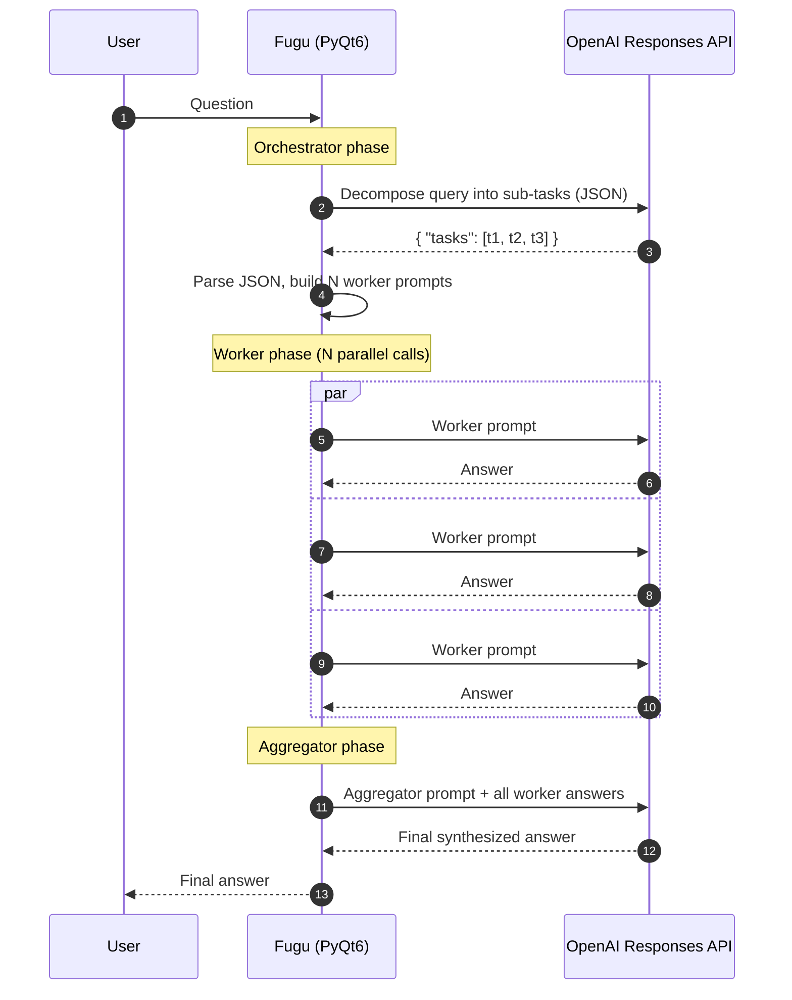
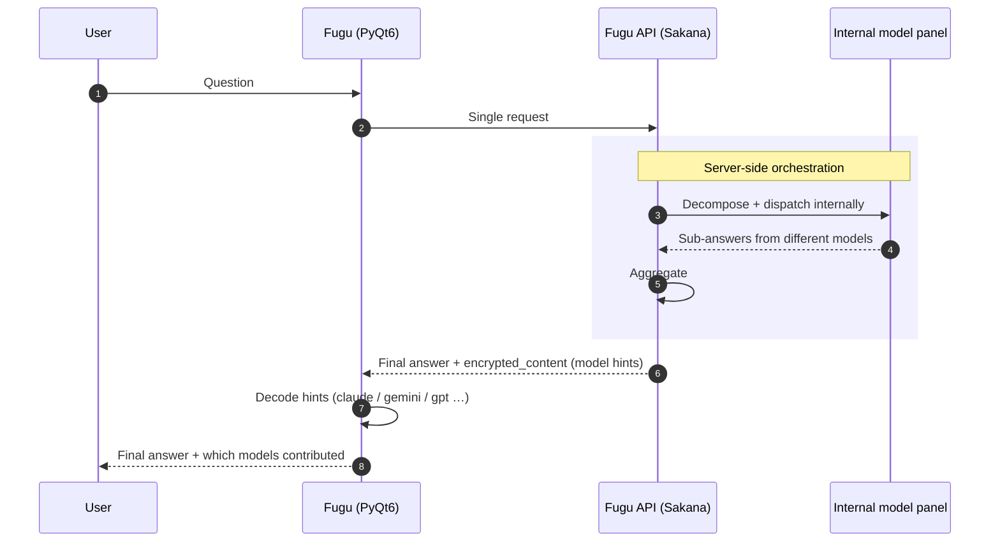
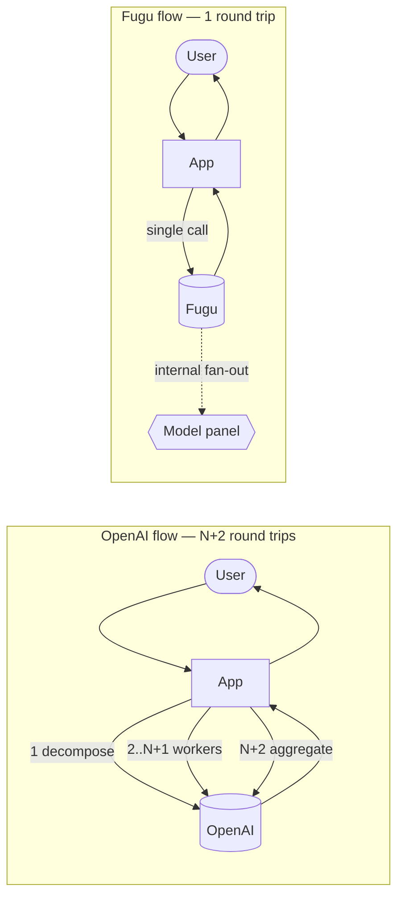

[English](README.md) | 한국어 | [中文](README.zh.md) | [日本語](README.ja.md)

# Fugu

**multi-step agent orchestration** 패턴을 두 가지 서로 다른 백엔드에 대해 벤치마킹하기
위한 PyQt6 데스크톱 클라이언트입니다: 일반적인 OpenAI Responses API 워크플로우와,
서버 측에서 오케스트레이션을 처리하는 [Sakana AI](https://sakana.ai)의 Fugu 모델 라인.

이 앱은 의도적으로 작게 만들어졌습니다 — 완성된 제품이 아니라 테스트 하니스입니다.
이 앱은 한 가지 특정한 비교를 명확하게 보여주기 위해 존재합니다: 쿼리가 작업 분해,
병렬 하위 질문 답변, 최종 집계를 필요로 할 때, **그 루프는 어디에 존재하는가 —
클라이언트인가, 모델인가?**

---

## 이 앱이 무엇을 테스트하는가?

현대의 "agentic" LLM 워크플로우는 일반적으로 자명하지 않은 쿼리에 대해 세 단계가
필요합니다:

1. 사용자의 질문을 하위 질문 또는 하위 작업으로 **분해(Decompose)** 합니다.
2. 각 하위 작업을 **실행(Execute)** 합니다 — 일반적으로 별도의 LLM 호출이며,
   종종 서로 다른 프롬프트를 사용합니다.
3. 하위 결과들을 일관된 최종 답변으로 **집계(Aggregate)** 합니다.

이것이 **Orchestrator → Workers → Aggregator** 패턴입니다. 오늘날 OpenAI Responses
API에서는 오케스트레이션 루프를 애플리케이션 코드 안에서 구현해야 합니다. 모든
단계가 각각의 라운드트립이 되고, 모든 재시도, 프롬프트 템플릿, JSON 파서, 병렬
디스패치를 클라이언트가 직접 소유해야 합니다.

Fugu의 주장은 오케스트레이션 루프를 모델 자체로 옮긴다는 것입니다. 클라이언트는
한 번의 요청만 보내고, 모델은 내부적으로 이종(heterogeneous) 하위 모델 패널
(서로 다른 벤더, 서로 다른 크기)로 팬아웃하여 응답을 집계한 후 단일한 최종 출력을
반환합니다. 응답에는 내부적으로 어떤 모델이 사용되었는지에 대한 힌트가 포함되어
있어서 클라이언트가 이를 표시할 수 있습니다.

이 앱은 두 흐름을 나란히 구현하여 동일한 쿼리에 대해 트레이드오프(지연 시간, 코드
복잡도, 토큰 회계, 관찰성)를 비교할 수 있도록 합니다.

---

## 아키텍처 비교

### 현재 — OpenAI Orchestrator (클라이언트 측 루프)

클라이언트가 오케스트레이션 루프를 소유합니다. 세 개의 API 단계, 그중 두 개는 N개의
병렬 호출을 포함하며, 모두 데스크톱의 PyQt6에서 조율됩니다.



**클라이언트가 소유해야 하는 것:**
- orchestrator / worker / aggregator를 위한 프롬프트 템플릿
- orchestrator의 작업 목록을 위한 JSON 파서 및 정리(cleanup)
- 병렬 디스패치 (`asyncio.gather` / `as_completed`)
- 호출별 재시도, 에러 처리, 강제 중지
- orchestrator + N개의 worker + aggregator에 걸친 토큰 사용량 누적
- 각 단계의 스트리밍 UX

비용 표면(cost surface)은 **1 + N + 1 라운드트립**이며, 모두 클라이언트에게
가시적이고 청구됩니다.

### Fugu 사용 시 (서버 측 오케스트레이션)

클라이언트는 한 번만 호출합니다. 모델은 내부적으로 이종 하위 모델 패널을 참조하고,
그 출력을 집계한 후, 참여한 모델에 대한 힌트가 임베드된 단일 응답을 반환합니다.



**클라이언트가 소유하는 것:**
- 하나의 프롬프트
- 하나의 응답 파서
- encrypted_content blob에 대한 힌트 디코더 (어떤 모델이 기여했는지)

비용 표면은 **1 라운드트립**입니다. 분해, 병렬성, 집계는 모두 서버의 문제입니다.

### 동일한 그림, 나란히 비교



이 저장소의 관련 코드 경로:

| 흐름 | 파일 |
| --- | --- |
| OpenAI orchestrator (클라이언트 루프) | `src/fugu/agent/model/OrchestratorOpenAIThread.py` |
| Fugu 채팅 스레드 | `src/fugu/chat/model/SakanaAIThread.py` |
| 패턴 선택기 | `src/fugu/agent/model/AgentModel.py` |
| 모델 힌트 디코더 (`encrypted_content`) | 두 파일 모두; 헬퍼 `_extract_model_hints`, `_extract_usage` |

---

## 설치

```bash
python -m venv .venv
source .venv/bin/activate
pip install -e .
```

이 명령은 `fugu` 콘솔 스크립트를 설치합니다.

### 최초 API 키 설정

API 키를 위한 **환경 변수는 없습니다**. 앱이 처음 실행되면 앱 옆에 `settings.ini`를
작성합니다. 키를 구성하려면:

1. 앱을 실행합니다 (`fugu` 또는 `python -m fugu.main`).
2. 툴바의 **Setting** 버튼(기어 아이콘) 또는 **File → Setting**을 클릭합니다.
3. **AI Provider** 아래에서 다음을 설정합니다:
   - **OpenAI API key** — OpenAI orchestrator 흐름에 필요합니다
     (Agent 탭 → Orchestrator 패턴).
   - **Sakana API key** — Fugu 채팅 흐름에 필요합니다 (Chat 탭).
4. 저장합니다. 키는 `settings.ini`에 영구 저장됩니다.

> Sakana 키는 Fugu와 호환되는 키여야 합니다 (Sakana AI 대시보드에서 발급).
> 401 `Invalid API key`는 키가 잘못되었거나, 만료되었거나, 다른 Sakana 제품용으로
> 범위가 지정되었음을 의미합니다.

---

## 실행

```bash
python -m fugu.main
```

콘솔 스크립트는 어떤 작업 디렉터리에서도 동작합니다 — `settings.ini`와 `fugu.db`는
항상 현재 작업 디렉터리가 아니라 `main.py` 옆에 (또는 PyInstaller 번들의 경우 실행
파일 옆에) 배치됩니다.

### 앱이 생성하는 파일

| 파일 | 위치 | 내용 |
| --- | --- | --- |
| `settings.ini` | `main.py` / 실행 파일 옆 | API 키, 모델 파라미터, 프롬프트 템플릿, UI 환경설정 |
| `fugu.db` | `main.py` / 실행 파일 옆 | SQLite 히스토리: 채팅, agent 실행, 프롬프트 |

두 파일 모두 `.gitignore`를 통해 버전 관리에서 제외됩니다. Wheel/PyInstaller 빌드도
이들을 제외하므로 새 설치는 항상 빈 상태에서 시작됩니다.

---

## 독립 실행 파일 빌드 (PyInstaller)

앱은 이미 소스/프로즌(frozen) 두 모드 모두에서 데이터 자산과 설정을 찾는 방법을
알고 있으므로 PyInstaller 호출은 간단합니다.

```bash
pip install pyinstaller

pyinstaller \
  --name fugu \
  --windowed \
  --onefile \
  --paths src \
  --add-data "src/fugu/ico:ico" \
  --add-data "src/fugu/splash:splash" \
  --icon src/fugu/ico/app.ico \
  src/fugu/main.py
```

결과: `dist/fugu` (Linux/macOS) 또는 `dist\fugu.exe` (Windows)에 단일 바이너리가
생성됩니다. 그 파일을 어디든 복사해서 실행하면 됩니다 — 함께 배포해야 할
`_internal/` 디렉터리는 없습니다.

**런타임에서 번들은 다음과 같이 동작합니다:**

| 경로 | 해석되는 위치 |
| --- | --- |
| 리소스 베이스 (아이콘 / 스플래시) | `sys._MEIPASS` — 실행 시 생성되는 임시 추출 디렉터리 |
| 사용자 데이터 베이스 (`settings.ini`, `fugu.db`) | 실행 파일이 포함된 디렉터리 (`Path(sys.executable).parent`) |

따라서 `fugu`를 `~/Apps/`에 복사하고 실행하면 `~/Apps/settings.ini`와
`~/Apps/fugu.db`가 바이너리 옆에 생성되고, 번들된 Qt/Python 런타임은 임시
디렉터리에 추출되었다가 종료 시 정리됩니다. 해석(resolution)은
`src/fugu/util/Paths.py`의 `resource_base()`와 `user_data_base()`에 있습니다.

> `--icon` 플래그는 Linux에서 조용히 무시됩니다 (PyInstaller는 Windows와 macOS에서만
> 이를 존중합니다). Linux에서 아이콘을 설정하려면 `.desktop` 파일을 함께 배포하세요.

---

## 프로젝트 레이아웃

```
src/fugu/
├── main.py                 # 진입점: splash + MainWindow + signal wiring
├── chat/                   # Chat 탭 — Sakana Fugu 흐름
│   ├── ChatPresenter.py
│   ├── model/
│   │   ├── ChatModel.py
│   │   └── SakanaAIThread.py
│   └── view/
├── agent/                  # Agent 탭 — Orchestrator / Evaluator 패턴
│   ├── AgentPresenter.py
│   ├── model/
│   │   ├── AgentModel.py
│   │   ├── OrchestratorOpenAIThread.py
│   │   └── EvaluatorOpenAIThread.py
│   └── view/
├── custom/                 # 공유 Qt 위젯
├── util/
│   ├── Paths.py            # resource_base() / user_data_base()
│   ├── SettingsManager.py  # QSettings INI 래퍼
│   ├── SqliteDatabase.py   # QSqlDatabase 래퍼
│   └── …
├── ico/                    # 아이콘 (wheel + PyInstaller에 번들됨)
└── splash/                 # Splash 이미지
```

구조는 [`hyun-yang/MyChatGPT`](https://github.com/hyun-yang/MyChatGPT)에서 영감을
받았습니다 (아이콘 세트, 스레딩 관용구, SettingsManager 패턴).

---

## 의존성

- Python 3.11+
- `PyQt6 >= 6.7`
- `openai >= 1.51`

선택 사항:

- `pyinstaller` — 독립 실행 바이너리를 생성할 때만 필요합니다.

---

## 라이선스

아직 지정되지 않았습니다.
