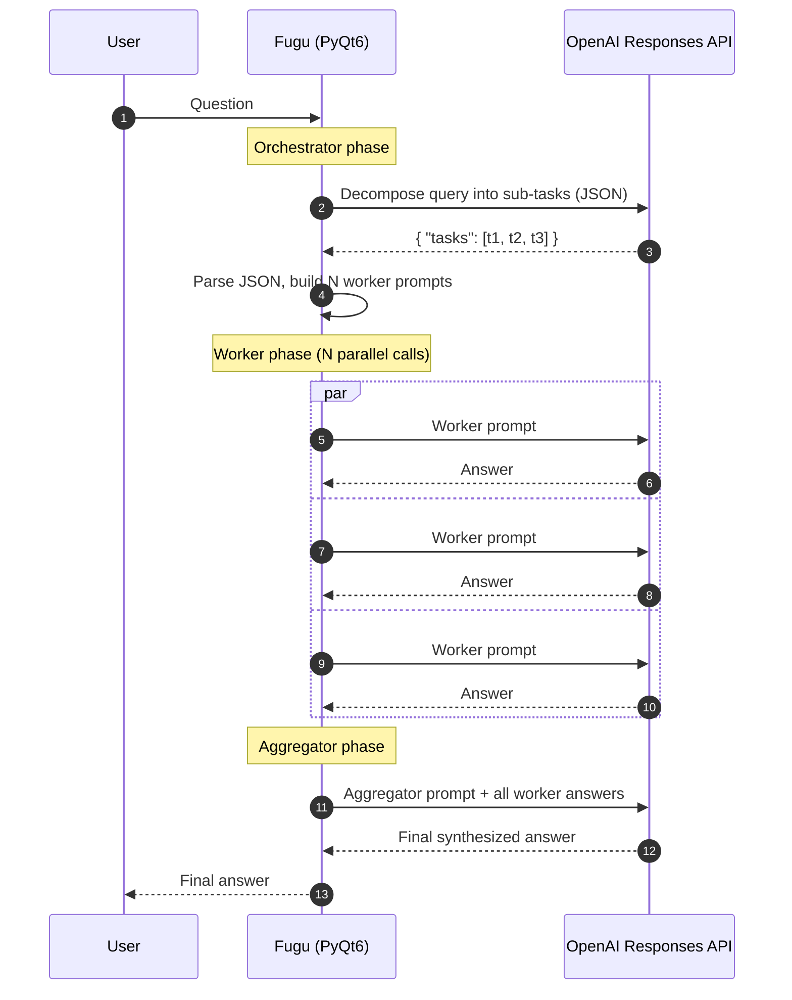
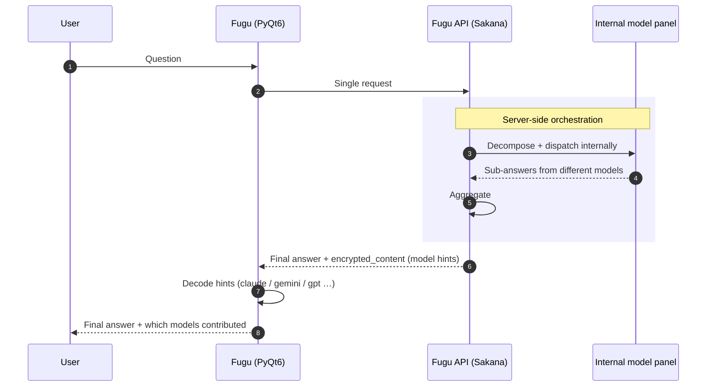
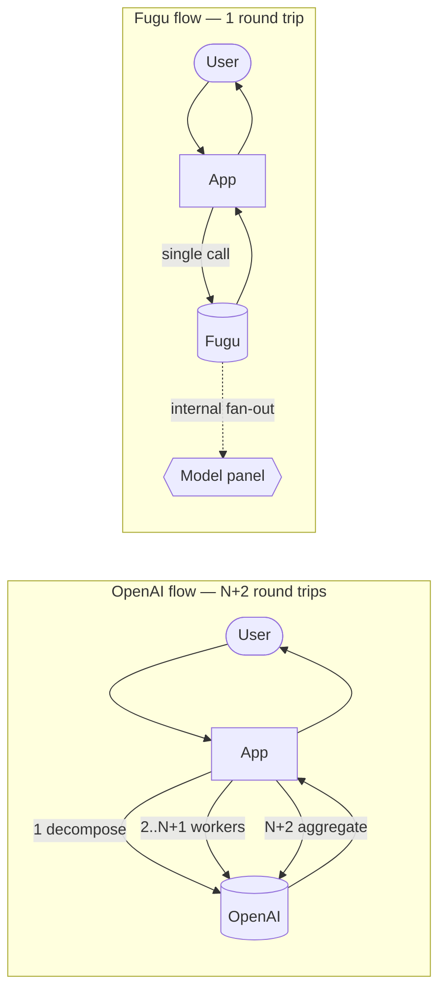

English | [한국어](README.ko.md) | [日本語](README.ja.md) | [中文](README.zh.md)

# Fugu-PyQt6

PyQt6 desktop client for benchmarking **multi-step agent orchestration** patterns against
two different backends: a conventional OpenAI Responses API workflow, and
[Sakana AI](https://sakana.ai)'s Fugu model line, which handles orchestration on the
server side.

The app is small on purpose — it is a test harness, not a finished product. It exists to
make one specific comparison legible: when a query requires task decomposition,
parallel sub-question answering, and final aggregation, **where does that loop live —
in the client, or in the model?**

---

## What problem is this testing?

Modern "agentic" LLM workflows usually need three steps for a non-trivial query:

1. **Decompose** the user's question into sub-questions or sub-tasks.
2. **Execute** each sub-task — typically a separate LLM call, often with different prompts.
3. **Aggregate** the sub-results into a coherent final answer.

This is the **Orchestrator → Workers → Aggregator** pattern. With the OpenAI Responses
API today, the orchestration loop has to be implemented in your application code. Every
phase becomes its own round-trip; every retry, prompt template, JSON parser, and parallel
dispatch is something your client has to own.

Fugu's pitch is that the orchestration loop is moved into the model itself. The client
makes one request, and the model internally fans out to a heterogeneous panel of
sub-models (different vendors, different sizes), aggregates the responses, and returns a
single final output. The response carries hints about which internal models were used so
the client can display them.

This app implements both flows side-by-side so the trade-offs (latency, code complexity,
token accounting, observability) can be compared on identical queries.

---

## Architecture comparison

### Current — OpenAI Orchestrator (client-side loop)

The client owns the orchestration loop. Three API phases, two of them with N parallel
calls, all coordinated from PyQt6 on the desktop.



**What the client has to own:**
- Prompt templates for orchestrator / worker / aggregator
- JSON parser + cleanup for the orchestrator's task list
- Parallel dispatch (`asyncio.gather` / `as_completed`)
- Per-call retry, error handling, force-stop
- Token usage accumulation across orchestrator + N workers + aggregator
- Streaming UX for each phase

The cost surface is: **1 + N + 1 round trips**, all visible and billable to the client.

### With Fugu (server-side orchestration)

The client makes one call. The model internally consults a heterogeneous panel of
sub-models, aggregates their outputs, and returns a single response with embedded hints
about which models participated.



**What the client owns:**
- One prompt
- One response parser
- Hint decoder for the encrypted_content blob (which models contributed)

The cost surface is: **1 round trip.** Decomposition, parallelism, and aggregation are
the server's problem.

### Same picture, side by side



The relevant code paths in this repo:

| Flow | File |
| --- | --- |
| OpenAI orchestrator (client loop) | `src/fugu/agent/model/OrchestratorOpenAIThread.py` |
| Fugu chat thread | `src/fugu/chat/model/SakanaAIThread.py` |
| Pattern selector | `src/fugu/agent/model/AgentModel.py` |
| Model-hint decoder (`encrypted_content`) | both files; helpers `_extract_model_hints`, `_extract_usage` |

---

## Setup

```bash
python -m venv .venv
source .venv/bin/activate
pip install -e .
```

That installs the `fugu` console script.

### First-time API key setup

There is **no environment variable** for the API key. The first time the app runs, it
writes a `settings.ini` next to the app. To configure keys:

1. Launch the app (`fugu` or `python -m fugu.main`).
2. Click the **Setting** toolbar button (gear icon) or **File → Setting**.
3. Under **AI Provider**, set:
   - **OpenAI API key** — required for the OpenAI orchestrator flow
     (Agent tab → Orchestrator pattern).
   - **Sakana API key** — required for the Fugu chat flow (Chat tab).
4. Save. The keys are persisted to `settings.ini`.

> The Sakana key must be a Fugu-compatible key (issued from the Sakana AI dashboard).
> A 401 `Invalid API key` means the key is wrong, expired, or scoped for a different
> Sakana product.

---

## Run

```bash
python -m fugu.main
```

The console script works from any working directory — `settings.ini` and `fugu.db` are
always placed next to `main.py` (or next to the executable in a PyInstaller bundle), not
in the current working directory.

### Files the app creates

| File | Where | What |
| --- | --- | --- |
| `settings.ini` | next to `main.py` / the executable | API keys, model parameters, prompt templates, UI preferences |
| `fugu.db` | next to `main.py` / the executable | SQLite history: chats, agent runs, prompts |

Both files are excluded from version control via `.gitignore`. Wheel/PyInstaller builds
also exclude them, so a fresh install always starts with an empty state.

---

## Build a standalone executable (PyInstaller)

The app already knows how to find its data assets and config in either mode (source /
frozen), so the PyInstaller invocation is straightforward.

```bash
pip install pyinstaller

pyinstaller \
  --name fugu \
  --windowed \
  --onefile \
  --paths src \
  --add-data "src/fugu/ico:ico" \
  --add-data "src/fugu/splash:splash" \
  --icon src/fugu/ico/app.ico \
  src/fugu/main.py
```

Result: a single binary at `dist/fugu` (Linux/macOS) or `dist\fugu.exe` (Windows). Copy
that file anywhere and run it — there is no `_internal/` directory to ship alongside.

**At runtime the bundle behaves like this:**

| Path | Resolves to |
| --- | --- |
| Resource base (icons / splash) | `sys._MEIPASS` — a temporary extraction directory created on launch |
| User-data base (`settings.ini`, `fugu.db`) | Directory containing the executable (`Path(sys.executable).parent`) |

So if you copy `fugu` to `~/Apps/` and run it, `~/Apps/settings.ini` and `~/Apps/fugu.db`
are created next to the binary; the bundled Qt/Python runtime is extracted to a temp
directory and cleaned up on exit. Resolution lives in `src/fugu/util/Paths.py` —
`resource_base()` and `user_data_base()`.

> The `--icon` flag is silently ignored on Linux (PyInstaller only honors it on Windows
> and macOS). To set an icon on Linux, ship a `.desktop` file.

---

## Project layout

```
src/fugu/
├── main.py                 # entry point: splash + MainWindow + signal wiring
├── chat/                   # Chat tab — Sakana Fugu flow
│   ├── ChatPresenter.py
│   ├── model/
│   │   ├── ChatModel.py
│   │   └── SakanaAIThread.py
│   └── view/
├── agent/                  # Agent tab — Orchestrator / Evaluator patterns
│   ├── AgentPresenter.py
│   ├── model/
│   │   ├── AgentModel.py
│   │   ├── OrchestratorOpenAIThread.py
│   │   └── EvaluatorOpenAIThread.py
│   └── view/
├── custom/                 # Shared Qt widgets
├── util/
│   ├── Paths.py            # resource_base() / user_data_base()
│   ├── SettingsManager.py  # QSettings INI wrapper
│   ├── SqliteDatabase.py   # QSqlDatabase wrapper
│   └── …
├── ico/                    # Icons (bundled into wheel + PyInstaller)
└── splash/                 # Splash image
```

The structure is inspired by
[`hyun-yang/MyChatGPT`](https://github.com/hyun-yang/MyChatGPT) (icon set, threading
idiom, SettingsManager pattern).

---

## Dependencies

- Python 3.11+
- `PyQt6 >= 6.7`
- `openai >= 1.51`

Optional:

- `pyinstaller` — only needed when producing standalone binaries.

---


### Evaluator-Optimizer Prompt Sample

- Evaluator-Optimizer Prompt sample

```markdown
1) Evaluator Prompt

Evaluate this following code implementation for:
1. code correctness
2. time complexity
3. style and best practices

You should be evaluating only and not attemping to solve the task.
Only output "PASS" if all criteria are met and you have no further suggestions for improvements.
Output your evaluation concisely in the following format.

<evaluation>PASS, NEEDS_IMPROVEMENT, or FAIL</evaluation>
<feedback>
What needs improvement and why.
</feedback>


2) Generator Prompt

Your goal is to complete the task based on <user input>. If there are feedback 
from your previous generations, you should reflect on them to improve your solution

Output your answer concisely in the following format: 

It MUST have <thoughts> and <response> Tag.

<thoughts>
[Your understanding of the task and feedback and how you plan to improve]
</thoughts>

<response>
[Your code implementation here]
</response>


3) Task Prompt

<user input>
Implement a Stack with:
1. push(x)
2. pop()
3. getMin()
All operations should be O(1).
</user input>
```

### Orchestrator-Worker Workflows Prompt Sample
- Orchestrator-Worker Prompt sample

```markdown
1) Orchestrator Prompt

Analyze the following user question and break it down into 2 or 3 related sub-questions:

Respond in the following format:
{
    "analysis": "Provide a detailed explanation of your understanding of the user question and the rationale behind the sub-questions you created.",
    "tasks": [
        {
            "task": "Sub-question 1",
            "description": "Explain the intent and main point of this sub-question."
        },
        {
            "task": "Sub-question 2",
            "description": "Explain the intent and main point of this sub-question."
        }
        // Include additional sub-questions as necessary
    ]
}
Generate a maximum of 2 or 3 sub-questions.

User question: {user_query}


2) Worker Prompt

Addressing the sub-questions derived from the following user question.

Original question: {user_query}  
Sub-question: {task}

Explanation: {description}

Provide a thorough and detailed response that addresses the sub-question.


3) Aggregator Prompt

Provide a final response that summarize the questions and responses below.

- The responses to the sub-questions should be as comprehensive and detailed as possible.
- The final report should be presented in a comprehensive manner using Markdown format.

User's original question:
{user_query}

Sub-questions and final responses:

```
