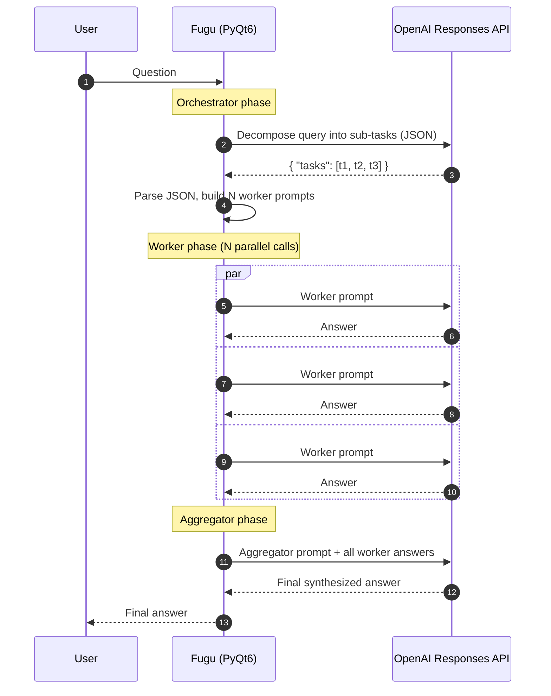
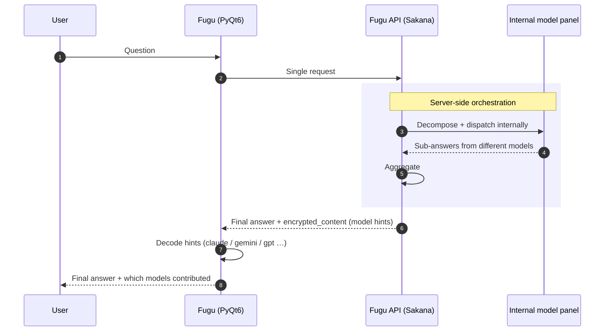
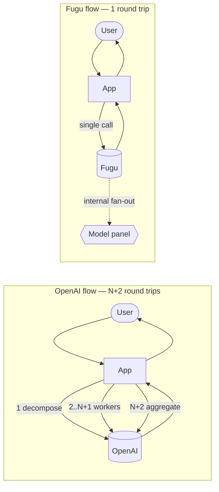

[English](README.md) | [한국어](README.ko.md) | 中文 | [日本語](README.ja.md)

# Fugu-PyQt6

PyQt6 桌面客户端，用于针对两种不同的后端对**多步骤 agent orchestration**模式进行
基准测试：一种是传统的 OpenAI Responses API 工作流，另一种是
[Sakana AI](https://sakana.ai) 的 Fugu 模型系列，后者在服务端处理 orchestration。

这个应用是有意做小的 —— 它是一个测试 harness，而不是一个成品。它的存在是为了让一个
特定的比较变得清晰可见：当一个查询需要任务分解、并行子问题回答和最终聚合时，
**那个循环位于何处 —— 在客户端，还是在模型中？**

---

## 这是在测试什么问题？

现代的"agentic" LLM 工作流对于非平凡的查询通常需要三个步骤：

1. 将用户的问题**分解（Decompose）**为子问题或子任务。
2. **执行（Execute）**每个子任务 —— 通常是一个独立的 LLM 调用，往往使用不同的
   prompt。
3. 将子结果**聚合（Aggregate）**为一个连贯的最终答案。

这就是 **Orchestrator → Workers → Aggregator** 模式。在今天的 OpenAI Responses
API 下，orchestration 循环必须在你的应用代码中实现。每个阶段都成为一次独立的往返；
每一次重试、每一个 prompt 模板、每一个 JSON 解析器、每一次并行分发都得由你的客户端
承担。

Fugu 的主张是把 orchestration 循环搬进模型本身。客户端只发出一次请求，模型在内部
向一个异构（heterogeneous）的子模型面板（不同的厂商、不同的规模）扇出，聚合各个
响应，然后返回单一的最终输出。响应中携带着关于内部使用了哪些模型的提示，客户端
可以据此显示出来。

这个应用并排实现了两种流程，以便在相同的查询上比较它们之间的权衡（延迟、代码复杂度、
token 计费、可观测性）。

---

## 架构对比

### 当前 —— OpenAI Orchestrator（客户端循环）

客户端拥有 orchestration 循环。三个 API 阶段，其中两个包含 N 次并行调用，全部由
桌面端的 PyQt6 协调。



**客户端必须承担的东西：**
- orchestrator / worker / aggregator 的 prompt 模板
- 用于 orchestrator 任务列表的 JSON 解析器 + 清理逻辑
- 并行分发（`asyncio.gather` / `as_completed`）
- 每次调用的重试、错误处理、强制停止
- 跨 orchestrator + N 个 worker + aggregator 的 token 用量累计
- 各个阶段的流式 UX

成本面是：**1 + N + 1 次往返**，全部对客户端可见且都要计费。

### 使用 Fugu（服务端 orchestration）

客户端只调用一次。模型在内部咨询一个异构的子模型面板，聚合它们的输出，并返回单一
响应，其中嵌入了关于哪些模型参与了的提示。



**客户端拥有的东西：**
- 一个 prompt
- 一个响应解析器
- encrypted_content blob 的 hint 解码器（哪些模型做出了贡献）

成本面是：**1 次往返。** 分解、并行性和聚合都是服务端的事。

### 同一张图，并排对比



本仓库中相关的代码路径：

| 流程 | 文件 |
| --- | --- |
| OpenAI orchestrator（客户端循环） | `src/fugu/agent/model/OrchestratorOpenAIThread.py` |
| Fugu 聊天线程 | `src/fugu/chat/model/SakanaAIThread.py` |
| 模式选择器 | `src/fugu/agent/model/AgentModel.py` |
| 模型 hint 解码器（`encrypted_content`） | 两个文件中均有；辅助函数 `_extract_model_hints`、`_extract_usage` |

---

## 安装

### 首次 API key 设置

**没有用于 API key 的环境变量**。应用首次运行时会在应用旁边写出一份
`settings.ini`。要配置 key：

1. 启动应用（`fugu` 或 `python -m fugu.main`）。
2. 点击工具栏的 **Setting** 按钮（齿轮图标），或者 **File → Setting**。
3. 在 **AI Provider** 下，设置：
   - **OpenAI API key** —— OpenAI orchestrator 流程所必需
     （Agent 标签页 → Orchestrator 模式）。
   - **Sakana API key** —— Fugu 聊天流程所必需（Chat 标签页）。
4. 保存。key 会被持久化到 `settings.ini`。

> Sakana key 必须是与 Fugu 兼容的 key（从 Sakana AI 控制台签发）。
> 401 `Invalid API key` 意味着 key 错误、过期，或被限定到了另一个 Sakana 产品。

---

## 运行

```bash
python -m fugu.main
```

控制台脚本可在任意工作目录下使用 —— `settings.ini` 和 `fugu.db` 始终被放在
`main.py` 旁边（或者在 PyInstaller 打包中放在可执行文件旁边），而不是当前工作目录。

### 应用会创建的文件

| 文件 | 位置 | 内容 |
| --- | --- | --- |
| `settings.ini` | `main.py` / 可执行文件旁边 | API key、模型参数、prompt 模板、UI 偏好设置 |
| `fugu.db` | `main.py` / 可执行文件旁边 | SQLite 历史记录：聊天、agent 运行、prompt |

两个文件都通过 `.gitignore` 从版本控制中排除。Wheel/PyInstaller 构建同样会排除
它们，所以全新安装总是以空状态开始。

---

## 构建独立可执行文件（PyInstaller）

应用已经知道如何在源代码模式和 frozen 模式下找到它的数据资源和配置，所以
PyInstaller 的调用很直接。

```bash
pip install pyinstaller

pyinstaller \
  --name fugu \
  --windowed \
  --onefile \
  --paths src \
  --add-data "src/fugu/ico:ico" \
  --add-data "src/fugu/splash:splash" \
  --icon src/fugu/ico/app.ico \
  src/fugu/main.py
```

结果：一个位于 `dist/fugu`（Linux/macOS）或 `dist\fugu.exe`（Windows）的单一
二进制文件。把这个文件复制到任何地方运行即可 —— 不需要随附 `_internal/` 目录。

**运行时这个 bundle 的行为如下：**

| 路径 | 解析为 |
| --- | --- |
| 资源根目录（图标 / splash） | `sys._MEIPASS` —— 启动时创建的临时解压目录 |
| 用户数据根目录（`settings.ini`、`fugu.db`） | 包含可执行文件的目录（`Path(sys.executable).parent`） |

所以如果你把 `fugu` 复制到 `~/Apps/` 并运行它，`~/Apps/settings.ini` 和
`~/Apps/fugu.db` 会被创建在二进制文件旁边；打包好的 Qt/Python 运行时会被解压到
一个临时目录，并在退出时清理。解析逻辑位于 `src/fugu/util/Paths.py` ——
`resource_base()` 和 `user_data_base()`。

> `--icon` 标志在 Linux 上会被静默忽略（PyInstaller 只在 Windows 和 macOS 上
> 尊重它）。要在 Linux 上设置图标，请随附一个 `.desktop` 文件。

---

## 项目布局

```
src/fugu/
├── main.py                 # 入口点：splash + MainWindow + signal wiring
├── chat/                   # Chat 标签页 —— Sakana Fugu 流程
│   ├── ChatPresenter.py
│   ├── model/
│   │   ├── ChatModel.py
│   │   └── SakanaAIThread.py
│   └── view/
├── agent/                  # Agent 标签页 —— Orchestrator / Evaluator 模式
│   ├── AgentPresenter.py
│   ├── model/
│   │   ├── AgentModel.py
│   │   ├── OrchestratorOpenAIThread.py
│   │   └── EvaluatorOpenAIThread.py
│   └── view/
├── custom/                 # 共享的 Qt 控件
├── util/
│   ├── Paths.py            # resource_base() / user_data_base()
│   ├── SettingsManager.py  # QSettings INI 封装
│   ├── SqliteDatabase.py   # QSqlDatabase 封装
│   └── …
├── ico/                    # 图标（打包进 wheel + PyInstaller）
└── splash/                 # Splash 图片
```

这个结构受到 [`hyun-yang/MyChatGPT`](https://github.com/hyun-yang/MyChatGPT) 的
启发（图标集、线程惯用法、SettingsManager 模式）。

---

## 依赖

- Python 3.11+
- `PyQt6 >= 6.7`
- `openai >= 1.51`

可选：

- `pyinstaller` —— 仅在生成独立二进制文件时需要。

---


### Evaluator-Optimizer Prompt 示例

- Evaluator-Optimizer Prompt 示例

```markdown
1) Evaluator Prompt

请按照以下标准评估下面的代码实现：
1. 代码正确性
2. 时间复杂度
3. 风格和最佳实践

你只需要进行评估，不要尝试解决该任务。
只有当所有标准都满足且你没有进一步的改进建议时，才输出 "PASS"。
请按照以下格式简洁地输出你的评估。

<evaluation>PASS、NEEDS_IMPROVEMENT 或 FAIL</evaluation>
<feedback>
需要改进的内容及其原因。
</feedback>


2) Generator Prompt

你的目标是基于 <user input> 完成任务。如果之前生成的结果有反馈，
你应该反映这些反馈以改进你的解决方案。

请按照以下格式简洁地输出你的答案：

必须包含 <thoughts> 和 <response> Tag。

<thoughts>
[你对任务和反馈的理解，以及你计划如何改进]
</thoughts>

<response>
[在这里放置你的代码实现]
</response>


3) Task Prompt

<user input>
实现一个 Stack，支持：
1. push(x)
2. pop()
3. getMin()
所有操作都应为 O(1)。
</user input>
```

### Orchestrator-Worker 工作流 Prompt 示例

- Orchestrator-Worker Prompt 示例

```markdown
1) Orchestrator Prompt

分析以下用户问题，并将其拆分为 2 个或 3 个相关的子问题：

请按照以下格式回答：
{
    "analysis": "详细说明你对用户问题的理解，以及你创建这些子问题的理由。",
    "tasks": [
        {
            "task": "子问题 1",
            "description": "解释这个子问题的意图和核心要点。"
        },
        {
            "task": "子问题 2",
            "description": "解释这个子问题的意图和核心要点。"
        }
        // 如有必要，请包含其他子问题
    ]
}
最多生成 2 个或 3 个子问题。

用户问题：{user_query}


2) Worker Prompt

回答从以下用户问题中派生出的子问题。

原始问题：{user_query}  
子问题：{task}

说明：{description}

提供一个全面且详细的回答，以回应这个子问题。


3) Aggregator Prompt

提供一个最终回答，总结下面的问题和回答。

- 对子问题的回答应尽可能全面且详细。
- 最终报告应以 Markdown 格式全面呈现。

用户的原始问题：
{user_query}

子问题和最终回答：

```
